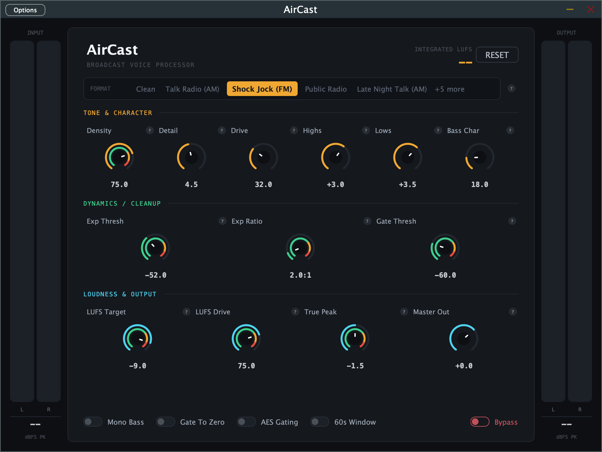

# AirCast

**Broadcast Voice Processor** — a VST3 / AU / Standalone audio plugin built with [JUCE](https://juce.com), by Fully Modulated.

AirCast chains together a downward expander, a noise gate, a 3-band compressor, tone shaping,
a "format character" stage modeled on the mix style of common radio formats, and a
loudness-normalizing true-peak limiter — everything you'd want to take a vocal or a full mix
and land it dense, warm, and broadcast-ready at a consistent, peak-safe loudness.



## Features

- **10 Format Character presets** — Clean, Talk Radio (AM), Shock Jock (FM), Public Radio,
  Late Night Talk (AM), Top 40 (CHR), Classic Rock (FM), News Anchor, Urban/Hip-Hop, and
  Classical/Fine Arts — each a tuned bundle of EQ, saturation, and compression feel. Two of
  them (Talk Radio, Late Night Talk) apply a real cascaded AM-bandwidth lowpass, not just a
  tonal shelf.
- **3-band broadcast compressor** ("Density") — independent low/mid/high gain reduction via
  phase-corrected Linkwitz-Riley crossovers, so a kick/808 transient doesn't duck the vocal
  band along with it.
- **Post-compression saturation** ("Drive") and a **high-frequency exciter** ("Detail") for
  warmth and clarity.
- **Tone shaping** — high/low shelving EQ, band-limited low-end saturation ("Bass Char",
  confined to below 120 Hz), and mono-bass summing for a solid, mono-compatible low end.
- **Downward expander + noise gate** — fast, transparent, continuous cleanup of room tone and
  dead air, independent of the hard-mute gate stage.
- **Continuous LUFS loudness normalization** — a practical BS.1770-style loudness servo with
  configurable target, correction strength, silence gating, and a fast/slow averaging window.
- **2×-oversampled true-peak limiter** as the final safety ceiling, catching inter-sample
  peaks a non-oversampled limiter would miss.
- **Live per-stage metering** — every knob's ring shows real-time gain reduction / activity at
  that exact stage, layered under the value arc showing where the knob is set.
- Stereo-only, sample-rate agnostic, VST3 / AU / Standalone from one codebase.

## Documentation

| Doc | What it's for |
|---|---|
| [MANUAL.md](MANUAL.md) | End-user manual — the interface, every control explained, preset descriptions, workflow tips, troubleshooting. **Start here if you just want to use the plugin.** |
| [PRESET_GUIDE.md](PRESET_GUIDE.md) | Deep technical dive into the full signal chain and exactly what each of the 10 presets sets internally and why. |
| [INSTALL.md](INSTALL.md) | Building AirCast from source on macOS / Windows / Linux. |
| [PACKAGING.md](PACKAGING.md) | Cutting a distributable installer (`.pkg` / `.exe` / `.tar.gz`) from a Release build — maintainer-facing. |
| [DESIGN_BRIEF.md](DESIGN_BRIEF.md) | The UI's original look-and-feel design brief. |

## Getting AirCast

There are no pre-built installers published yet — this is an early, actively-developed
(`v0.1.0`) project. To get a working plugin today:

1. Build it from source — see **[INSTALL.md](INSTALL.md)** for the full walkthrough on
   macOS/Windows/Linux. In short:
   ```bash
   cmake -B build-release -DCMAKE_BUILD_TYPE=Release
   cmake --build build-release --target AirCast_VST3 -j 8
   ```
   JUCE is fetched automatically via CMake's `FetchContent` — no manual JUCE setup needed. The
   plugin auto-installs into your platform's standard plugin folder as part of the build.
2. Or, if you just want a shareable installer rather than a dev build, see
   **[PACKAGING.md](PACKAGING.md)** for the scripts that wrap a Release build into a `.pkg`
   (macOS), Inno Setup `.exe` (Windows), or `.tar.gz` + `install.sh` (Linux).

**macOS is the only platform this project has actually been built and tested on so far.** The
Windows and Linux build/packaging instructions are written correctly to the standard JUCE +
CMake / Inno Setup / POSIX shell mechanics, but haven't been executed on those platforms yet —
see the honesty notes in `INSTALL.md`/`PACKAGING.md` before relying on them for a real release.

## Tech stack

- [JUCE 8.0.6](https://juce.com) (pulled automatically via CMake `FetchContent`, not vendored)
- C++17, CMake 3.22+
- No external DSP dependencies — everything in `Source/DSP/` is original, built on
  `juce::dsp` primitives (IIR filters, Linkwitz-Riley crossovers, the oversampler, the
  compressor/limiter building blocks)

## Repository structure

```
AirCast/
├── CMakeLists.txt              # JUCE plugin target (VST3/AU/Standalone) + DspProbe diagnostic tool
├── Source/
│   ├── PluginProcessor.{h,cpp} # Signal chain orchestration (processBlock), parameter plumbing
│   ├── PluginEditor.{h,cpp}    # UI layout and painting
│   ├── Parameters.h            # Parameter layout + the 10 preset value tables
│   ├── DSP/                    # BroadcastCompressor, ToneShaper, CodecStage, LoudnessProcessor, DownwardExpander
│   └── GUI/                    # Custom LookAndFeel, metered knob, preset rail, meter rail, theme
├── Tools/DspProbe.cpp          # Console-only diagnostic app exercising the DSP classes directly
├── packaging/                  # Per-platform installer/packaging scripts (see PACKAGING.md)
└── docs/                       # README assets
```

## Status / license

Early-stage (`v0.1.0`), single-maintainer project. AirCast's own source is
[MIT licensed](LICENSE). Note that JUCE itself (fetched automatically at build time, not
vendored in this repo) has its own separate licensing terms — see
[juce.com/get-juce](https://juce.com/get-juce/) — which apply independently to anyone
building or distributing a compiled copy of this plugin.

---

Built collaboratively with [Claude Code](https://claude.com/claude-code) — the DSP chain,
bug fixes, UI fixes, and all of the documentation in this repo (including this README) were
developed through that collaboration, directed and reviewed by the maintainer.
